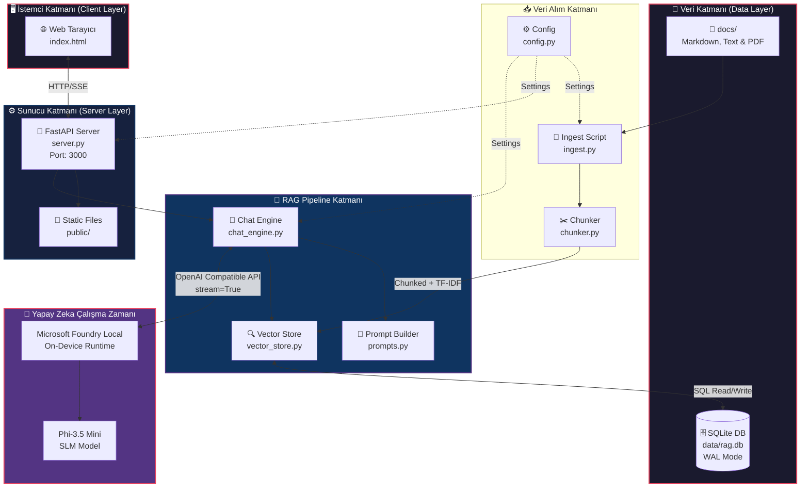
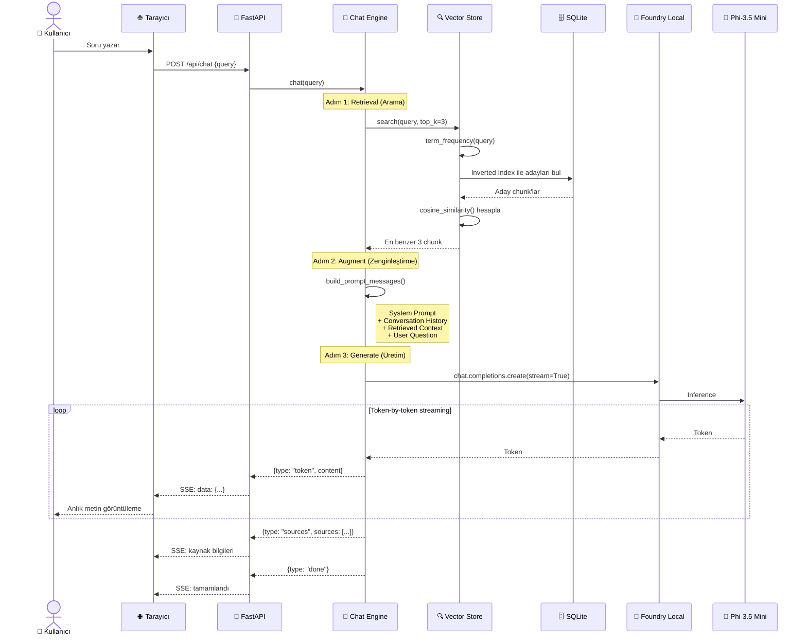
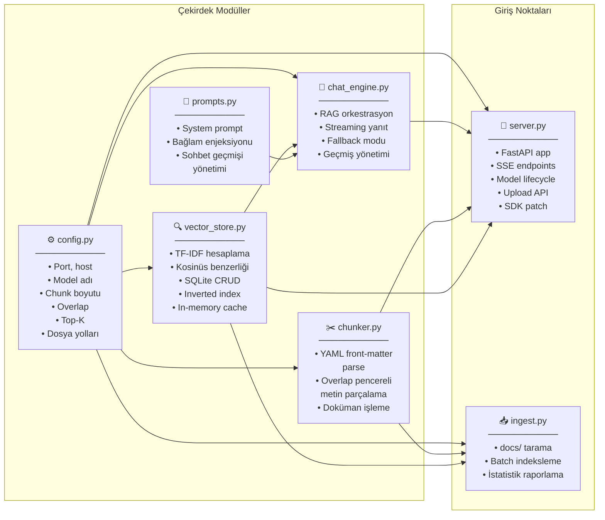
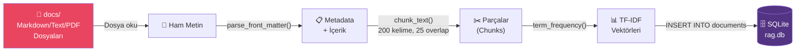
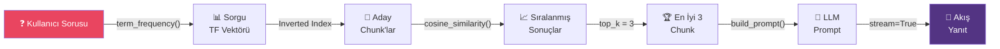
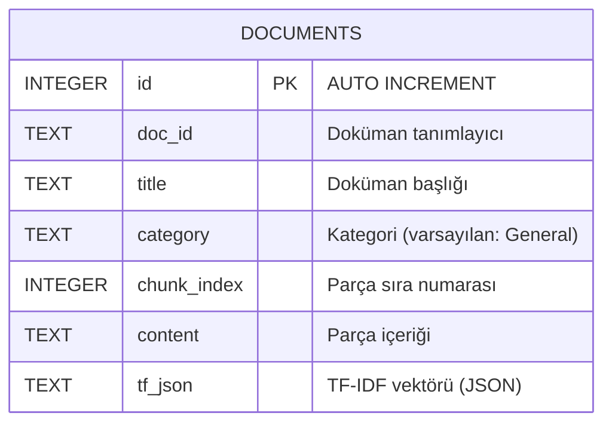
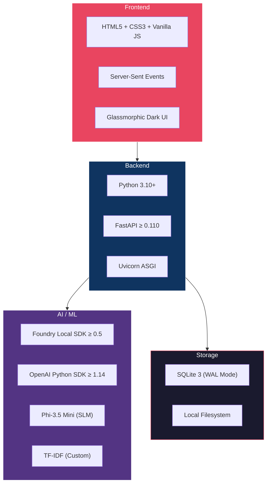

# 🤖 Local RAG AI Assistant with Microsoft Foundry Local

> **Tamamen çevrimdışı çalışan, tarayıcı tabanlı bir Soru-Cevap asistanı.**
> Retrieval-Augmented Generation (RAG) ve Microsoft Foundry Local ile güçlendirilmiştir.
> Bulut yok, API anahtarı yok, internet gerekmez.

A fully offline, browser-based Q&A assistant powered by **Retrieval-Augmented Generation (RAG)** and **Microsoft Foundry Local**, built with **Python**. No cloud, no API keys, no internet required after initial model download.

---

## 📋 İçindekiler / Table of Contents

- [Özellikler / Features](#-özellikler--features)
- [Sistem Mimarisi / System Architecture](#-sistem-mimarisi--system-architecture)
- [RAG Pipeline Akışı / RAG Pipeline Flow](#-rag-pipeline-akışı--rag-pipeline-flow)
- [Bileşen Mimarisi / Component Architecture](#-bileşen-mimarisi--component-architecture)
- [Veri Akışı / Data Flow](#-veri-akışı--data-flow)
- [Teknoloji Yığını / Tech Stack](#-teknoloji-yığını--tech-stack)
- [Ön Koşullar / Prerequisites](#-ön-koşullar--prerequisites)
- [Hızlı Başlangıç / Quick Start](#-hızlı-başlangıç--quick-start)
- [Proje Yapısı / Project Structure](#-proje-yapısı--project-structure)
- [API Referansı / API Reference](#-api-referansı--api-reference)
- [Sunum Metni / Presentation Script](#-sunum-metni--presentation-script)
- [Lisans / License](#-lisans--license)

---

## ✨ Özellikler / Features

| Özellik | Açıklama |
|---------|----------|
| 🔒 **Tamamen Çevrimdışı** | İlk model indirme sonrası internet gerektirmez |
| 🧠 **Yerel LLM** | Phi-3.5 Mini — Foundry Local SDK (CPU/NPU hızlandırma) |
| 📄 **Doküman İndeksleme** | Markdown/Text/PDF dosyalarını SQLite vektör deposuna aktarır |
| 🔍 **TF-IDF Arama** | Ters dizin + kosinüs benzerliği ile hızlı, şeffaf arama |
| 💬 **Akış Yanıt (Streaming)** | Server-Sent Events ile gerçek zamanlı token-token yanıt |
| 📱 **Responsive Arayüz** | Glassmorphic karanlık tema, mobil uyumlu |
| 📤 **Çalışma Zamanı Yükleme** | Sunucuyu yeniden başlatmadan yeni doküman ekleme |
| 📚 **Kaynak Atıfları** | Her yanıtta belge adı ve relevance % gösterir |

---

## 🏗️ Sistem Mimarisi / System Architecture

Aşağıdaki diyagram, sistemin uçtan uca genel mimarisini gösterir:



---

## 🔄 RAG Pipeline Akışı / RAG Pipeline Flow

Bir kullanıcı sorusu sorulduğunda RAG pipeline'ının adım adım işleyişi:



---

## 🧩 Bileşen Mimarisi / Component Architecture

Her Python modülünün sorumluluğu ve birbirleriyle ilişkisi:



---

## 📊 Veri Akışı / Data Flow

### Doküman İndeksleme Süreci (Ingestion Flow)



### Sorgu İşleme Süreci (Query Flow)



### SQLite Veritabanı Şeması



---

## 🛠️ Teknoloji Yığını / Tech Stack



---

## ⚙️ Ön Koşullar / Prerequisites

- **Python 3.10+**: [İndir / Download](https://www.python.org/)
- **Microsoft Foundry Local**: Cihaz üzerinde yapay zeka çalışma zamanı
  - Windows: `winget install Microsoft.FoundryLocal`
  - macOS/Linux: [Resmi dökümentasyon](https://learn.microsoft.com/en-us/ai/foundry-local/)

---

## 🚀 Hızlı Başlangıç / Quick Start

```bash
# 1. Bağımlılıkları kur / Install dependencies
pip install -r requirements.txt

# 2. Dokümanları vektör deposuna indeksle / Ingest documents
python src/ingest.py

# 3. Sunucuyu başlat / Start the server
python src/server.py
```

Tarayıcıda aç / Open in browser → [http://127.0.0.1:3000](http://127.0.0.1:3000)

> **Not / Note**: İlk çalıştırmada Phi-3.5 Mini modeli (~2 GB) indirilir. Sonraki çalıştırmalar önbellekten yüklenir.

---

## 📂 Proje Yapısı / Project Structure

```
📦 Local RAG AI Assistant
├── 📂 docs/                    # Kaynak dokümanlar (markdown/text/pdf)
│   ├── 01-rag-introduction.md
│   ├── 02-foundry-local-guide.md
│   ├── 03-embeddings-and-vectors.md
│   ├── 04-sqlite-guide.md
│   └── 05-prompt-engineering.md
├── 📂 data/                    # SQLite veritabanı (otomatik oluşturulur)
│   └── rag.db
├── 📂 public/                  # Frontend (tek HTML dosyası)
│   └── index.html
├── 📂 src/                     # Python kaynak kodları
│   ├── config.py               # Yapılandırma sabitleri
│   ├── chunker.py              # Overlap pencereli metin parçalama
│   ├── vector_store.py         # TF-IDF + SQLite vektör deposu
│   ├── prompts.py              # Sistem istemi mühendisliği
│   ├── chat_engine.py          # RAG pipeline orkestrasyonu
│   ├── ingest.py               # Doküman alım betiği
│   └── server.py               # FastAPI sunucu + API rotaları
├── requirements.txt            # Python bağımlılıkları
└── README.md                   # Bu dosya
```

---

## 📡 API Referansı / API Reference

| Method | Endpoint | Açıklama | Yanıt Tipi |
|--------|----------|----------|------------|
| `GET` | `/api/status` | Model yükleme durumu (SSE stream) | `text/event-stream` |
| `POST` | `/api/chat` | Soru sor, RAG yanıtı al (SSE stream) | `text/event-stream` |
| `POST` | `/api/upload` | Yeni doküman yükle ve indeksle | `application/json` |
| `GET` | `/api/documents` | İndekslenmiş doküman listesi | `application/json` |
| `POST` | `/api/clear` | Sohbet geçmişini temizle | `application/json` |

### SSE Event Tipleri

```json
// Token akışı
{"type": "token", "content": "Merhaba, bu bir "}

// Kaynak bilgileri
{"type": "sources", "sources": [{"title": "...", "docId": "...", "score": 0.85, "preview": "..."}]}

// Tamamlandı
{"type": "done"}
```

---

## 📄 Dokümanlarınızı Ekleme / Adding Your Own Documents

1. `.md`, `.txt` veya `.pdf` dosyalarını `docs/` klasörüne koyun
2. `python src/ingest.py` ile indeksleyin
3. `python src/server.py` ile sunucuyu başlatın

---

## 📜 Lisans / License

MIT
